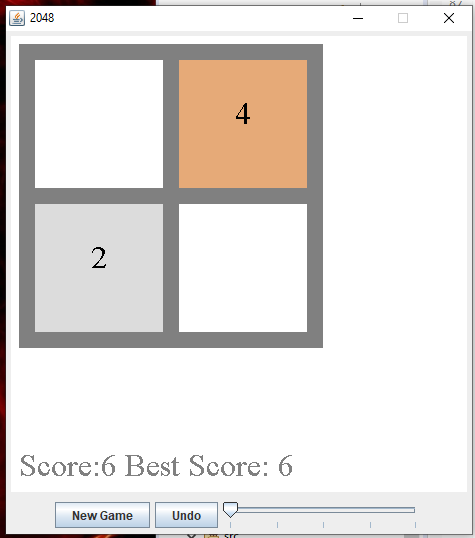
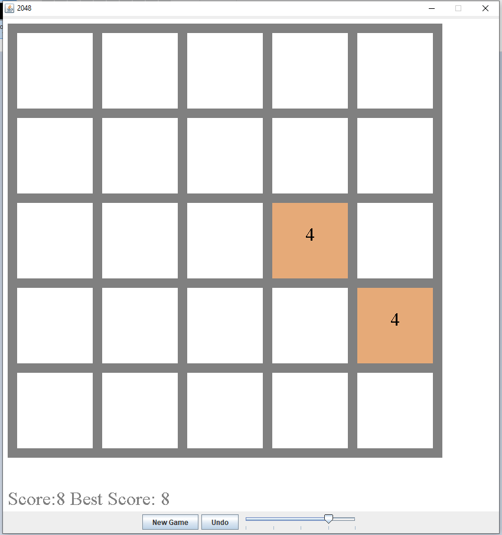
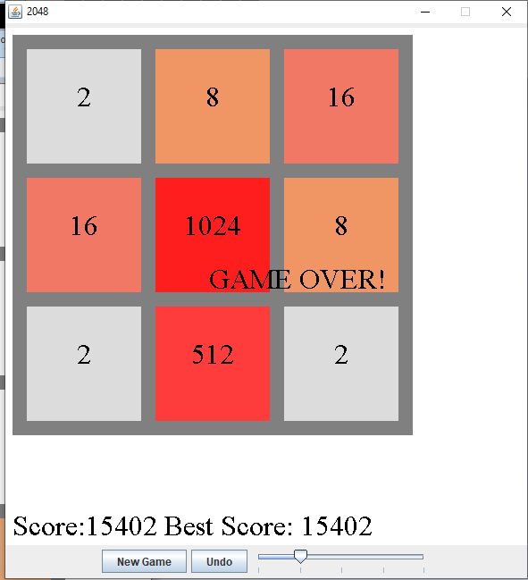

# Java2048

One of my first games. A remake of the popular game 2048. A simple game where the user slides all game tiles in either left, right, up, down direction using the arrow keys and tiles with same values will merge along with their values. The game has 5 difference board sizes, 2x2, 3x3, 4x4, 5x5 and 6x6 and can be set with a slider. The score is incremented for every new tile based on its value, and for every tile that is merged.

Potential new features would be:

* Animation for when tiles slide and merge.
* Fix for undo where the score does not undo.
* Save the highest score in a file that is loaded so highest score is not lost when application is closed
* Sounds for when tiles slide and merge
* Proper Merging that matches the original 2048 game.
* Reorganize the code to be more modular for maintainability and reusability such as having a Tile class

The application uses Java AWT (Abstract Window Toolkit) and Swing manage the game rendering and controlling. Everything is rendered in a canvas using a BufferStrategy and Graphics object. The Canvas is inside a JFrame and is updated on a separate thread that uses a game loop to call a tick() and render() methods at 60 calls a second.

The application consists of 2 classes, the Game class and Board class. The Game class manages the UI and renders/updates the application. The Board class manages the game and updates depending on the arrow keys that the user presses, with moveLeft(), moveRight(), moveDown(), moveUp(), which iterates the board and moves the tiles in the corresponding direction and merges tiles that can be merged and also spawns a new tile if one can spawns.
